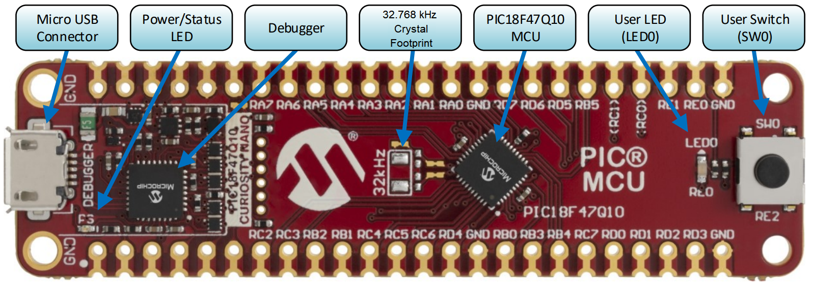
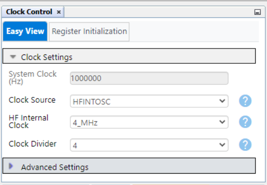
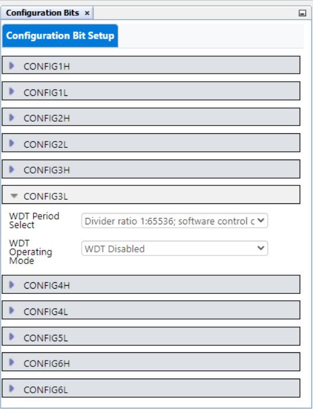
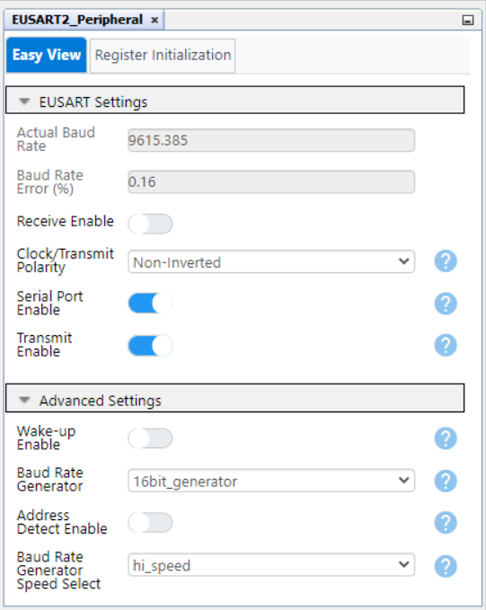
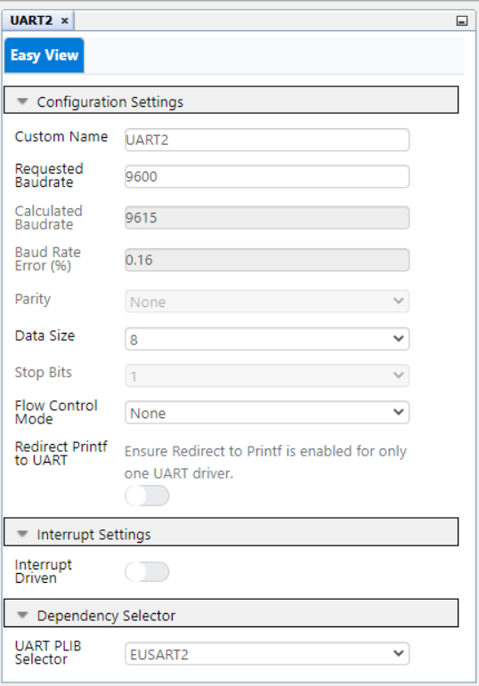
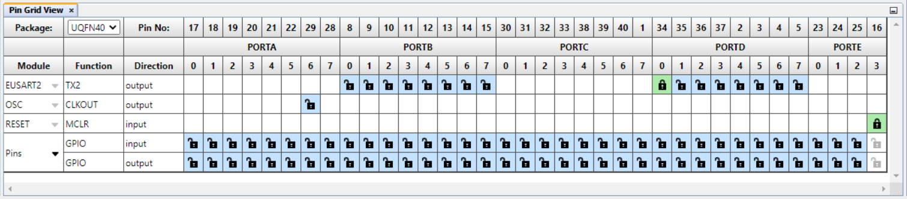
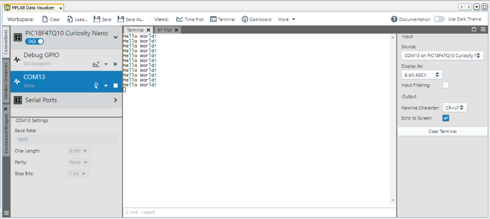
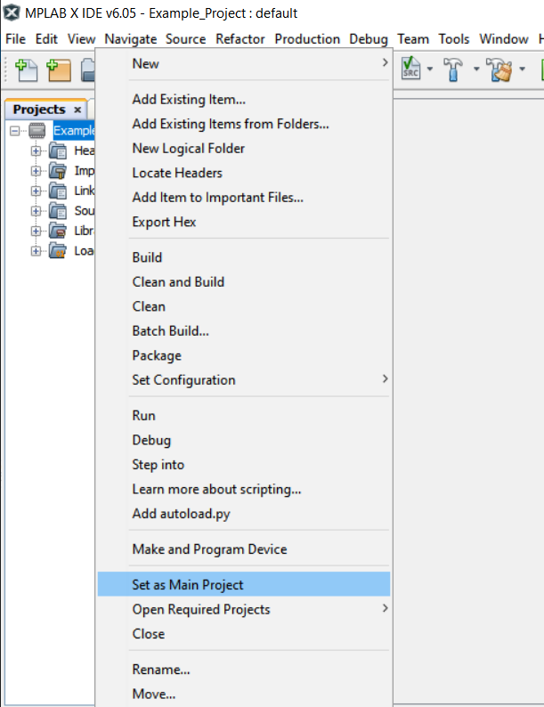
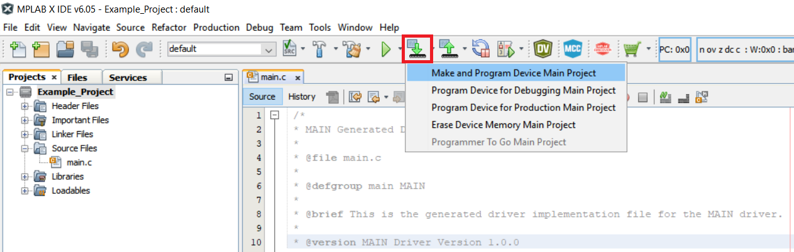

# Sending "Hello World" Message via EUSART using the PIC18F47Q10 Microcontroller with MCC Melody

This example shows how to send a string of messages through the EUSART peripheral from the PIC18F47Q10 microcontroller (MCU) to the PC and use MPLAB® Data Visualizer to see it.

## Related Documentation

- [Getting Started with UART using EUSART on PIC18](https://www.microchip.com/wwwappnotes/appnotes.aspx?appnote=en1003086)
- [PIC18-Q10 Product Family Page](https://www.microchip.com/design-centers/8-bit/pic-mcus/device-selection/pic18f-q10-product-family)
- [PIC18F47Q10 Data Sheet](http://ww1.microchip.com/downloads/en/DeviceDoc/40002043D.pdf)
- [PIC18F47Q10 Code Examples on GitHub](https://github.com/microchip-pic-avr-examples?q=pic18f47q10)

## Software Used

- [MPLAB® X IDE v6.05 or newer](http://www.microchip.com/mplab/mplab-x-ide)
- [MPLAB® XC8 2.40 or newer](http://www.microchip.com/mplab/compilers)
- [MPLAB® Code Configurator Melody](https://www.microchip.com/en-us/tools-resources/configure/mplab-code-configurator/melody)
- [MPLAB® Data Visualizer](https://www.microchip.com/en-us/tools-resources/debug/mplab-data-visualizer)
- [PIC18F-Q_DFP Device Family Pack v1.15.360 or newer](https://packs.download.microchip.com/)

## Hardware Used

- PIC18F47Q10 Curiosity Nano Development Board is used as a test platform. [(DM182029)](https://www.microchip.com/Developmenttools/ProductDetails/DM182029)
   

## Operation

To program the Curiosity Nano board with this MPLAB® X project, follow the steps provided in the [How to Program the Curiosity Nano Board](#how-to-program-the-curiosity-nano-board) chapter.  

## 1. Setup

The following peripheral and clock configurations are set up using MCC Melody for the PIC18F47Q10: 

 - Clock Control:
    - Clock Source: HFINTOSC
    - HF Internal Clock: 4 MHz
    - Clock Divider: 4
   
 
 - Configuration Bits:
    - CONFIG3L
        - WDT Operating Mode: WDT Disabled
    -  

 - EUSART2 Peripheral:
    - Transmit Enable: Enabled
    - Serial Port Enable: Enabled
   

 - UART2:
    - Requested Baudrate: 9600
    - UART PLIB Selector: EUSART2
   

 - Pin Grid View:
    - EUSART2 TX2: RD0 pin (CDC pin)
   

The following pin configuration must be made for this project:

|  Pin  |    Configuration    |      Function       |
| :---: | :-----------------: | :-----------------: |
|  RD0  | Digital Output      | EUSART2 TX          |

## 2. Demo

In this demo, the message `Hello World!` is sent via serial communication every 1000 ms. MPLAB X Data Visualizer is used as a terminal to see the output message.

 

## 3. Summary

In this example, EUSART most common configuration is used (asynchronous operation and 8N1 message format), and "Hello World" messages are transmitted. MPLAB X Data Visualizer is used to see the messages on the PC.

##  How to Program the Curiosity Nano board

This chapter shows how to use the MPLAB® X IDE to program an PIC® device with an Example_Project.X. This can be applied for any other projects. 

- Connect the board to the PC.

- Open the Example_Project.X project in MPLAB X IDE.

- Set the Example_Project.X project as main project.

  - Right click on the project in the **Projects** tab and click **Set as Main Project**.
     

- Clean and build the Example_Project.X project.

  - Right click on the **Example_Project.X** project and select **Clean and Build**.
     

- Select the **PICxxxxx Curiosity Nano** in the Connected Hardware Tool section of the project settings:

  - Right click on the project and click **Properties**
  - Click on the arrow under the Connected Hardware Tool
  - Select the **PICxxxxx Curiosity Nano** (click on the **SN**), click **Apply** and then click **OK**:
     

- Program the project to the board.
  - Right click on the project and click **Make and Program Device**.
     

 

- [Back to Setup](#1-setup)
- [Back to Demo](#2-demo)
- [Back to Summary](#3-summary) 
- [Back to Top](#sending-hello-world-message-via-eusart-using-the-pic18f47q10-microcontroller-with-mcc-melody)
